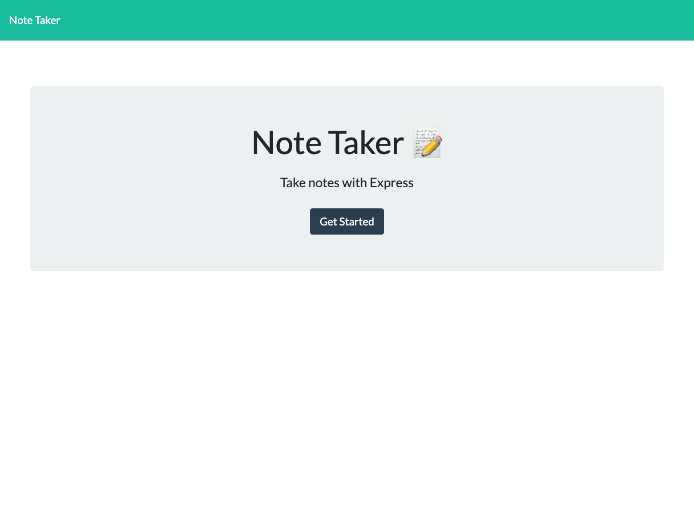
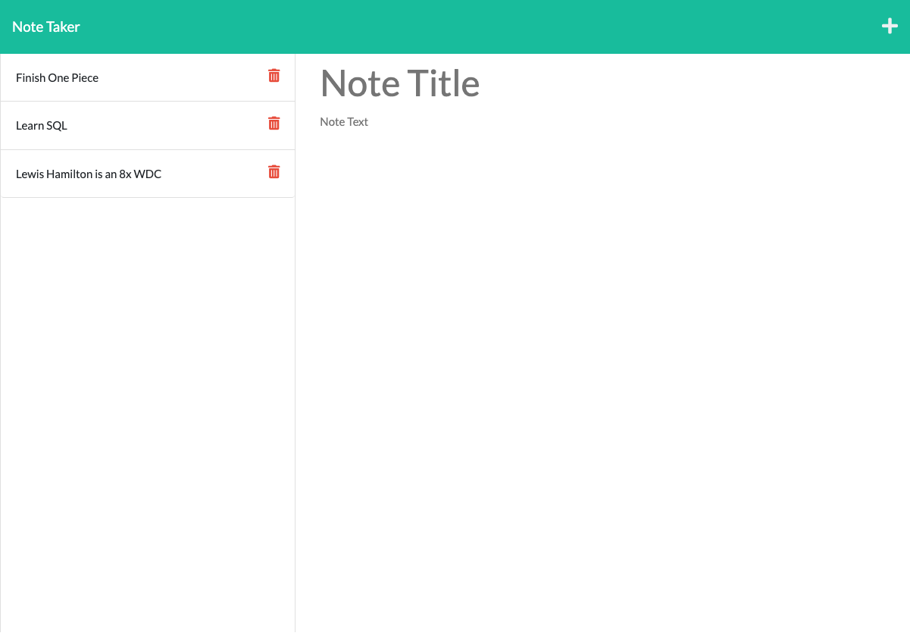
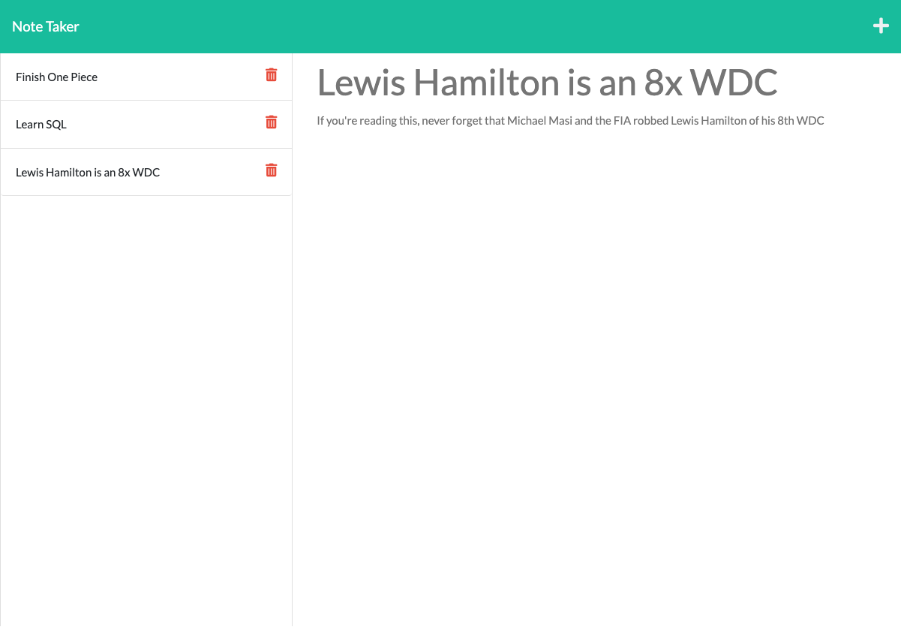

  # Note Taker

  

  ## Table of Contents

  * [Description](#description)
  * [Installation](#installation)
  * [Usage](#usage)
  * [License](#license)
  * [Contributing](#contributing)
  * [Tests](#tests)
  * [Questions](#questions)

  ---

  ## Description

  The purpose of the project is to use Express to build a server for a note taker so that notes from a client can be stored in the back-end then later retireved and served back to the client.

  ---

  ## Installation

  To install this project navigate to the root directory and run npm install in the terminal to install all of ths applications dependencies.

  ---

  ## Usage

  To use this application navigate to the root directory in the terminal and run npm start. There will be a confirmation message in the terminal indicating which port the server is running on if this is done successfully. Once the server is running open the browser and navigate to localhost:portname (eg. localhost:3001) and the main page of the site will load on the screen. Alternatively this application can be hosted on a cloud hosting service such as Heroku.

  ---

  ## License

  This is free and unencumbered software released into the public domain.
  
      Anyone is free to copy, modify, publish, use, compile, sell, or distribute this software, either in source code form or as a compiled binary, for any purpose, commercial or non-commercial, and by any means.
      
      In jurisdictions that recognize copyright laws, the author or authors of this software dedicate any and all copyright interest in the software to the public domain. We make this dedication for the benefit of the public at large and to the detriment of our heirs and successors. We intend this dedication to be an overt act of relinquishment in perpetuity of all present and future rights to this software under copyright law.
      
      THE SOFTWARE IS PROVIDED "AS IS", WITHOUT WARRANTY OF ANY KIND, EXPRESS OR IMPLIED, INCLUDING BUT NOT LIMITED TO THE WARRANTIES OF MERCHANTABILITY, FITNESS FOR A PARTICULAR PURPOSE AND NONINFRINGEMENT. IN NO EVENT SHALL THE AUTHORS BE LIABLE FOR ANY CLAIM, DAMAGES OR OTHER LIABILITY, WHETHER IN AN ACTION OF CONTRACT, TORT OR OTHERWISE, ARISING FROM, OUT OF OR IN CONNECTION WITH THE SOFTWARE OR THE USE OR OTHER DEALINGS IN THE SOFTWARE.

  ---

  ## Contributing

  To contribute to this project, fork the repo, make the changes, then submit a pull request.

  ---

  ## Demo

  
  
  

  ---

  ## Tests

  There are currently no tests for this application.

  ---

  ## Credits

  Jaryd Knight :heart_on_fire:

  ---

  ## Questions

  If you have any questions please check out my Github page and/ or send me an email.

  Github: [jarydknight](https://github.com/jarydknight)
  
  Email: placeholder@gmail.com
  